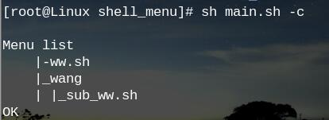

# shell_menu

自动化生成脚本目录，统一管理脚本

(以下链接由 [Vim_IDE](https://github.com/BillWang139967/Vim)自动生成)

* [usage](#usage)
* [功能展示](#功能展示)
	* [生成菜单文件](#生成菜单文件)
	* [开始使用](#开始使用)
* [相关项目](#相关项目)
* [版本发布](#版本发布)
* [参加步骤](#参加步骤)
* [小额捐款](#小额捐款)

## usage

> * 将脚本放到 sh_menu/Funtion 目录中(注:如果放到 Funtion 中包含子目录，会以目录名作为一级菜单选项)
> * sh main.sh -c 更新脚本目录文件
> * sh main.sh 进行使用

## 功能展示

### 生成菜单文件



### 开始使用


* 上图输入 1 ，即执行 ww.sh 脚本
* 上图输入 2 ，及进入 wang 目录,程序会判断是否在子目录，如果是在子目录，会自动加回退到上级目录选项
* 本程序仅支持二级菜单
* 如果输入中有字符输入错误，可以输入'Ctrl + Backspace' 进行删除操作

## 相关项目

python 终端菜单--[py_menu](https://github.com/BillWang139967/py_menu)

## 版本发布 
----
* v1.0.2，2016-10-21，更新: 支持自动生成二级菜单，目录结构调整
* v1.0.1，2016-08-12，新增: 发布初始版本。

## 参加步骤

* 在 GitHub 上 `fork` 到自己的仓库，然后 `clone` 到本地，并设置用户信息。
```
$ git clone https://github.com/BillWang139967/shell_menu.git
$ cd shell_menu
$ git config user.name "yourname"
$ git config user.email "your email"
```
* 修改代码后提交，并推送到自己的仓库。
```
$ #do some change on the content
$ git commit -am "Fix issue #1: change helo to hello"
$ git push
```
* 在 GitHub 网站上提交 pull request。
* 定期使用项目仓库内容更新自己仓库内容。
```
$ git remote add upstream https://github.com/BillWang139967/shell_menu.git
$ git fetch upstream
$ git checkout master
$ git rebase upstream/master
$ git push -f origin master
```
## 小额捐款

如果你觉得shell_menu对你有帮助, 可以对作者进行小额捐款(支付宝)


